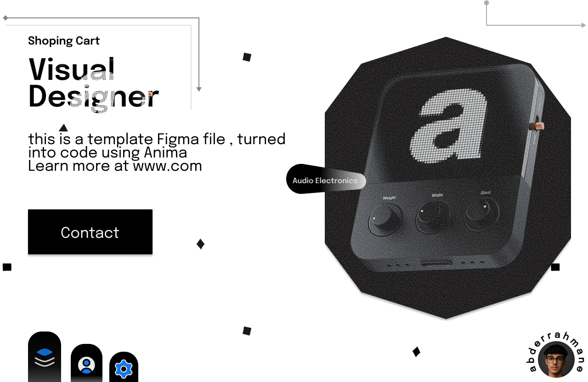

# 🎨 Figma Design Overview

This section presents the **mockup and visual prototype** for the project, created using **Figma**.  
It includes a preview image and a direct link to explore the interactive design.

---

## 🖼️ Preview

*A snapshot of the main interface concept (Electrons Shop).*

---

## 🔗 View the Full Design on Figma

Click below to open the interactive mockup and explore the full design flow:

[👉 **Open in Figma**](https://www.figma.com/design/agQ3JO0MIwi0DlIs5fbpBj/Untitled?node-id=0-1)

---

### 🧰 Tools & Resources
- **Design Tool:** [Figma](https://www.figma.com/)
- **File Type:** Mockup / Prototype
- **Purpose:** UI design exploration and layout visualization

---

> 💡 *Tip:* For a better experience, open the Figma link in fullscreen mode to explore all interactive elements.
